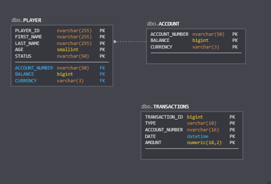

## WALLET MICROSERVICE
Build a simple wallet microservice running on the JVM that manages credit/debit
transactions on behalf of players.

#### Design
Spring Boot 2.2.6.RELEASE is used to design the REST API.

Database used is in memory db h2.
Below object model is used to design the schema for wallet-service.


Following API end points are avaialbe in the service.
* Create a Player.
   * URL: /player
   * Method: POST
   * Content-Type: application/json
   * Data : Player
   * Player Schema   
```json
{
  "$schema": "http://json-schema.org/draft-04/schema#",
  "type": "object",
  "properties": {
    "playerId": {
      "type": "string"
    },
    "firstName": {
      "type": "string"
    },
    "lastName": {
      "type": "string"
    },   
    "status": {
      "type": "string",
      "enum": ["ACTIVE", "SUSPENDED", "ARCHIVED"]
    },    
    "age": {
      "type": "integer"
    },
    "account": {
      "type": "object",
      "properties": {
        "accountNumber": {
          "type": "string"
        },
        "balance": {
          "type": "string"
        },
        "currency": {
          "type": "string"
        }
      },
      "required": [
        "accountNumber",
        "balance",
        "currency"
      ]
    }
  },
  "required": [
    "playerId",
    "firstName",
    "lastName",
    "age",
    "account"
  ]
}
```
----
* Check the balance of a player
   * URL: /player
   * Parameters: id (player id)
   * Method: GET     
   * Result: Balance info in String.
----
* Create a transaction
   * URL: /wallet/transaction
   * Method: POST
   * Content-Type: application/json
   * Data : Transaction   
   * Transaction Schema
```json
{
  "$schema": "http://json-schema.org/draft-04/schema#",
  "type": "object",
  "properties": {
    "transactionId": {
      "type": "string"
    },
    "type": {
      "type": "string",
      "enum": ["CREDIT", "DEBIT"]
    },
    "accountNumber": {
      "type": "string"
    },
    "date": {
      "type": "string"
    },
    "amount": {
      "type": "integer"
    }
  },
  "required": [
    "transactionId",
    "type",
    "accountNumber",
    "date",
    "amount"
  ]
}
```
----   
* Check the transaction history of a player
   * URL: /wallet/transaction
   * Method: GET
   * Parameters:
      * id
      * start (ISO_DATE_TIME format)
      * end (ISO_DATE_TIME format)
   * Result : List of Transactions
----

##### Java Docs are available in the _wallet-service/doc/index.html_. 

##### To run the service please follow the below steps. 
1) [Download the zip](https://github.com/SanalKumarK/wallet-service/archive/master.zip)
2) Unzip the downloaded file.
3) Navigate to the _wallet-service-master/_ folder
4) Open a terminal, and issue the following command.
    * java -jar wallet-0.0.1-SNAPSHOT.jar
    * Wait untill the services are up and running.

##### To test the service,     
1) To create a player, issue the following POST request with respective data.

    curl --header "Content-Type: application/json" \
    --request POST \
    --data '{ "playerId": "alice.bob",
          	  "firstName": "Alice",
              "lastName": "Bob",
              "age": 30,
              "status": "ACTIVE",
              "account": {
              	"accountNumber": "1234567890123456",
              	"balance": "1000",
              	"currency":"USD"
              }}'\
    localhost:8080/player   
    
2) To check the balance of a player,
    curl localhost:8080/wallet/balance?id={playerID}
    eg: curl localhost:8080/wallet/balance?id=alice.bob
 
3) To save a transaction to wallet service, 
     curl --header "Content-Type: application/json" \
         --request POST \
         --data '{ "transactionId":"1",
                 	"type": "CREDIT",
                 	"accountNumber":"1234567890123456",
                    "date": "2020-05-02T13:40:00.343+0000",
                    "amount": 300 }'\
         localhost:8080/wallet/transaction         

4) To get the history of transactions for a player,
    curl localhost:8080/wallet/transaction?id={playerId}&start={startTime}&end={endTime} 
    eg: curl "localhost:8080/wallet/transaction?id=alice.bob&start=2020-05-02T13:40:00Z&end=2020-05-05T21:41:54Z"
              
##### Please use the post man collection available in *utils/wallet-service.postman_collection.json* for query the services defined in wallet-service.

##### Please use the "wallet-services/src/main/resources/Test Plan.jmx" using Apache Jmeter for running the performance test on the wallet-service.
